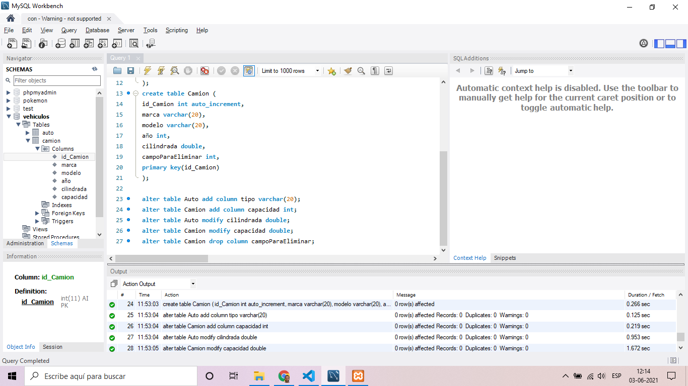

# Módulo 2 - SQL día 4 semana 5

## Crear algunas tablas, modificar sus columnas, eliminar columnas

### Crear Base de Datos:
     create database Vehiculos character set utf8;
     use Vehiculos;
### Crear tablas:
     create table Auto (
     id_Auto int auto_increment,
     marca varchar(20),
     modelo varchar(20),
     año int,
     cilindrada int,
     primary key(id_Auto)
     );

     create table Camion (
     id_Camion int auto_increment,
     marca varchar(20),
     modelo varchar(20),
     año int,
     cilindrada double,
     campoParaEliminar int,
     primary key(id_Camion)
     );
### Agregar columnas
     alter table Auto add column tipo varchar(20);
     alter table Camion add column capacidad int;
### Modificar Columnas
     alter table Auto modify cilindrada double;
     alter table Camion modify capacidad double;
### Eliminar Columnas
     alter table Camion drop column campoParaEliminar;
### Eliminar Tablas
     drop table Camion;