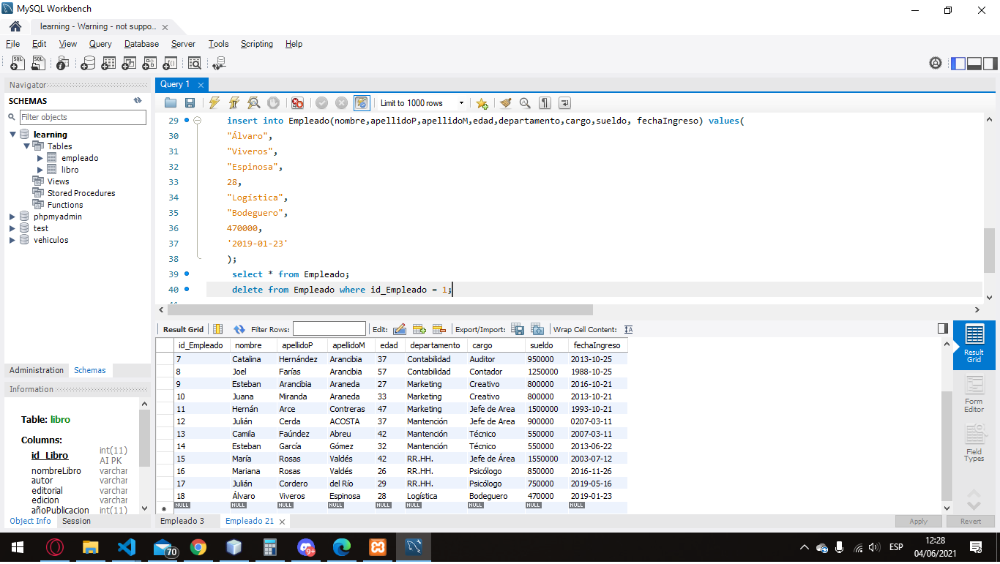

# Módulo 2 - SQL día 5 semana 6

## Control
Según lo visto en clase crear y realizar lo solicitado:
- Crear una base de datos con 2 tablas.
- Agregar dos nuevos campos a las tablas ya creadas.
- Cambiar el tipo de dato a un campo de la tabla.
- Eliminar un campo de cada tabla creada.

[Respuesta](./Control.txt)

## Ejercicio

Crear una base de datos, con las siguientes tablas:

Empleado: idEmpleado, nombre, apellidoP, apellidoM, edad, departamento, cargo, sueldo, fechaIngreso.

Libro: idLibro, nombreLibro, autor, editorial, edicion, añoPublicacion, categoria, ejemplares

Crear una tercera tabla con sus respectivos campos

#### Crear base de datos
      create database Learning character set utf8;
      use Learning;
#### Crear tabla Empleado
      create table Empleado (
      id_Empleado int auto_increment,
      nombre varchar(20),
      apellidoP varchar(20),
      apellidoM varchar(20),
      edad int,
      departamento varchar(20),
      cargo varchar(20),
      sueldo int,
      fechaIngreso date,
      primary key(id_Empleado)
      );
#### Crear tabla Libro
      create table Libro(
      id_Libro int auto_increment,
      nombreLibro varchar(20),
      autor varchar(20),
      editorial varchar(20),
      edicion varchar(20),
      añoPublicacion int,
      categoria varchar(20),
      ejemplares int,
      primary key(id_Libro)
      );
#### Insertar registros en Libro 
      insert into Empleado(nombre,apellidoP,apellidoM,edad,departamento,cargo,sueldo, fechaIngreso) values(
	    "Johana",
	    "Viveros",
      "Espinosa",
	    28,
	    "Manufactura",
	    "Técnico",
	    470000,
	    '2019-01-23'
	    );
