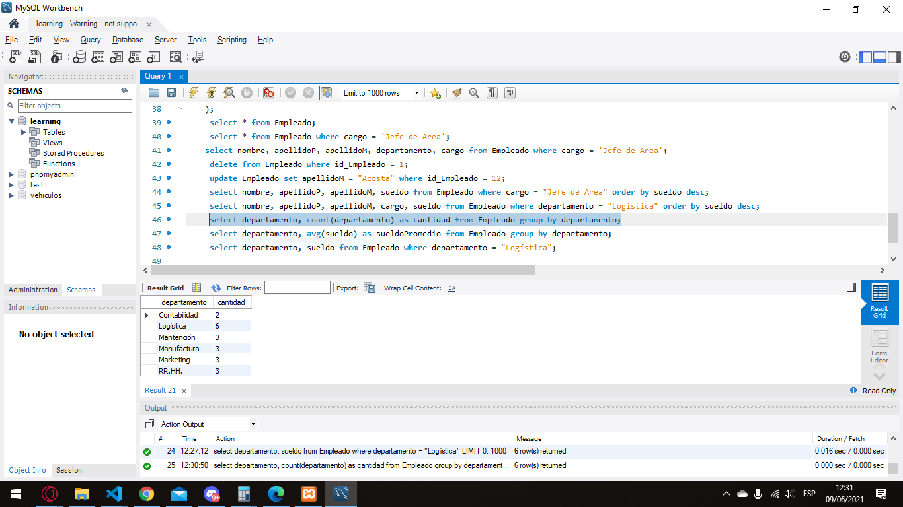

# Módulo 2 - SQL día 3 semana 7

## Captura

## Ejercicio
### Determinar los datos de los libros que no pertenecen a dos editoriales ( definidas por ustedes).
    select nombreLibro, Editorial, ejemplares from Libro where Editorial not in ("Universitaria","Planeta");
### Determinar los datos nombreLibro, Editorial y ejemplares de los libros cuyos ejemplares se encuentren entre 100 y 330.
    select nombreLibro, Editorial, ejemplares from Libro where ejemplares between 100 and 330;
### Determinar el nombre, apellidoP y cargo de los empleados que tienen un sueld entre  $550.000 y $750.000.
    select nombre, apellidoP, cargo from Empleado where sueldo between 550000 and 750000;
### Determinar nombre, apellidoP, apellidoM, cargo, deaprtamento y edad de los empleados que no pertenecen al departamento (departamento definido por ustedes).
    select nombre, apellidoP, apellidoM, cargo, departamento, edad from Empleado where departamento not in ("Marketing");
### Determinar los datos de los libros que empiecen con la letra (letra determinada por ustedes).
    select nombreLibro, Editorial, ejemplares from Libro where nombreLibro like 'L%';

### Cláusula orderBy
    select * from Empleado order by sueldo desc;
    select nombreLibro, Editorial from Libro orderby Ejemplares asc;
    select nombre, apellidoP, apellidoM, sueldo from Empleado where cargo = "Jefe de Area" order by sueldo desc;
### Cláusula Group by
    select departamento, count(departamento) as cantidad from Empleado group by departamento;
### Funciones: avg()
    select departamento, avg(sueldo) as sueldoPromedio from Empleado group by departamento;
    select Editorial, avg(ejemplares) as promedioEjemplares from Libro group by ejemplares;